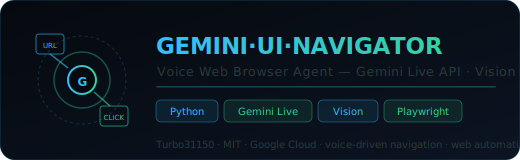

<div align="center">
  
  <br/><br/>

  [](LICENSE)
  [](#)
  [](#)
  [](#)
  [](#)
  [](#)
  [](https://github.com/Turbo31150/jarvis-linux)

  <br/>

  [](https://github.com/Turbo31150/gemini-ui-navigator-agent/stargazers)
  [](https://github.com/Turbo31150/gemini-ui-navigator-agent/network/members)
  [](https://github.com/Turbo31150/gemini-ui-navigator-agent/issues)
  [](https://github.com/Turbo31150/gemini-ui-navigator-agent/commits)

  <br/>
  <h3>Voice-Driven Web Browser Agent · Gemini Live API Vision · Playwright Automation</h3>
  <p><em>Navigate the web by voice — Gemini sees the screen and executes actions on your behalf</em></p>
</div>

---

## Overview

**GEMINI·UI·NAVIGATOR** is a voice-driven web browser agent powered by the **Gemini Live API** with vision capabilities. It "sees" the web interface via screenshot capture, understands your voice commands, and executes actions (clicks, typing, navigation) via **Playwright** — completely hands-free.

You speak, Gemini sees the page, understands the layout, and acts. No selectors, no scripting — just natural language.

> **Why this agent?** Traditional browser automation requires writing code. GEMINI·UI·NAVIGATOR lets you control any website by voice, with AI vision understanding what's on screen — true accessibility and automation for everyone.

---

## Features

| Feature | Description | Tech |
|---------|-------------|------|
| **Web Vision** | Gemini analyzes the screen in real-time via screenshots | Gemini Vision |
| **Voice Commands** | "Click on login" → action executed instantly | Gemini STT |
| **Navigation** | "Go to google.com" → Playwright navigates | Playwright |
| **Form Filling** | "Fill the email field with john@example.com" → auto-input | Playwright |
| **Screenshot Analysis** | Capture + AI analysis at every step | Gemini Vision |
| **Element Detection** | Gemini identifies buttons, links, inputs without selectors | Vision LLM |
| **Voice Confirmation** | Spoken feedback after every action | Gemini TTS |
| **Multi-tab** | "Open a new tab and go to GitHub" → tab management | Playwright |

---

## Voice Commands

| Category | Command | Action |
|----------|---------|--------|
| **Navigation** | *"Go to github.com"* | Navigate to URL |
| **Navigation** | *"Go back"* / *"Go forward"* | Browser history |
| **Click** | *"Click on the login button"* | Visual element click |
| **Click** | *"Click the third link"* | Positional click |
| **Type** | *"Type hello in the search box"* | Text input |
| **Form** | *"Fill the email field with my@email.com"* | Form filling |
| **Scroll** | *"Scroll down"* / *"Scroll to the bottom"* | Page scrolling |
| **Read** | *"What's on this page?"* | Page content summary |
| **Screenshot** | *"Show me what you see"* | Describe current screen |
| **Tab** | *"Open a new tab"* | Tab management |

---

## Architecture

```
┌──────────────────────────────────────────────────────────┐
│                     User (Microphone)                     │
│                "Click on the login button"                │
└──────────────────────┬───────────────────────────────────┘
                       │ voice stream
                       ▼
┌──────────────────────────────────────────────────────────┐
│             Gemini Live API (Google Cloud)                 │
│          STT  ←→  Vision + LLM  ←→  TTS                  │
│                                                           │
│   ┌─────────────────────────────────────────────────────┐ │
│   │  Screenshot analysis: element detection, layout     │ │
│   │  understanding, text recognition, button mapping    │ │
│   └─────────────────────────────────────────────────────┘ │
└──────────────────────┬───────────────────────────────────┘
                       │ intent + coordinates
                       ▼
┌──────────────────────────────────────────────────────────┐
│                  Action Router                            │
│                                                           │
│   ┌─────────────┬──────────────┬────────────────────┐    │
│   │  NAVIGATE   │    CLICK     │      TYPE          │    │
│   │  page.goto  │  page.click  │   page.fill        │    │
│   │  (url)      │  (selector)  │   (selector, text) │    │
│   └─────────────┴──────────────┴────────────────────┘    │
│   ┌─────────────┬──────────────┬────────────────────┐    │
│   │   SCROLL    │  SCREENSHOT  │      READ          │    │
│   │  page.eval  │  page.shot   │   page.content     │    │
│   │  (scroll)   │  → Gemini    │   → summarize      │    │
│   └─────────────┴──────────────┴────────────────────┘    │
└──────────────────────┬───────────────────────────────────┘
                       ▼
┌──────────────────────────────────────────────────────────┐
│              Playwright (Chromium)                         │
│     Headless or headed browser · captures screenshots     │
│     Executes actions · returns results to Gemini          │
└──────────────────────┬───────────────────────────────────┘
                       ▼
┌──────────────────────────────────────────────────────────┐
│          Voice Confirmation (Gemini TTS)                   │
│       "Done — I clicked the login button."                │
└──────────────────────────────────────────────────────────┘
```

---

## Quick Start

### Prerequisites

- Python 3.11+
- Google Cloud account with Gemini API access
- Microphone for voice commands

### Installation

```bash
# Clone the repository
git clone https://github.com/Turbo31150/gemini-ui-navigator-agent.git
cd gemini-ui-navigator-agent

# Install dependencies
pip install -r requirements.txt

# Install Playwright browser
playwright install chromium
```

### Configuration

```bash
# Set your Google Cloud credentials
export GOOGLE_API_KEY=AIza...
```

### Run

```bash
python main.py
```

> The agent opens a browser window and starts listening. Say "Go to google.com" to begin.

---

## Demo Flow

```
You:    "Go to github.com"
Agent:  [navigates to GitHub]
        "Done — GitHub is loaded. I can see the search bar,
         sign-in button, and trending repositories."

You:    "Click on Sign in"
Agent:  [clicks the Sign in button]
        "I've clicked Sign in. I can see the login form with
         username and password fields."

You:    "Type my-username in the username field"
Agent:  [types in the username field]
        "Done — I've entered your username. The password field
         is ready."

You:    "What do you see on this page?"
Agent:  "I see the GitHub login page. There's a username field
         filled with your name, an empty password field, a green
         Sign in button, and a 'Forgot password' link below."
```

---

## Use Cases

| Use Case | Description |
|----------|-------------|
| **Accessibility** | Hands-free web browsing for users with motor disabilities |
| **Automation** | Voice-driven web scraping and data entry without code |
| **Testing** | Natural language QA testing — "click every button and tell me what happens" |
| **Monitoring** | "Go to the dashboard and read me the stats" — periodic voice checks |
| **Training** | Teach non-technical users to navigate complex web apps |

---

## JARVIS Ecosystem

This project is part of the **JARVIS** distributed AI cluster:

| Project | Description |
|---------|-------------|
| [jarvis-linux](https://github.com/Turbo31150/jarvis-linux) | Distributed Autonomous AI Cluster |
| [TradeOracle](https://github.com/Turbo31150/TradeOracle) | Autonomous Crypto Trading Agent |
| [lumen](https://github.com/Turbo31150/lumen) | Multilingual Live AI Web App |
| [gemini-creative-storyteller](https://github.com/Turbo31150/gemini-creative-storyteller) | Interactive AI Storyteller |
| [gemini-live-trading-agent](https://github.com/Turbo31150/gemini-live-trading-agent) | Voice Trading Assistant |
| **gemini-ui-navigator-agent** | Voice Web Browser Agent *(this repo)* |

---

## License

MIT © 2026 [Turbo31150](https://github.com/Turbo31150) — Franck Delmas

> Built with Google Cloud · Gemini Live API Vision · Playwright
